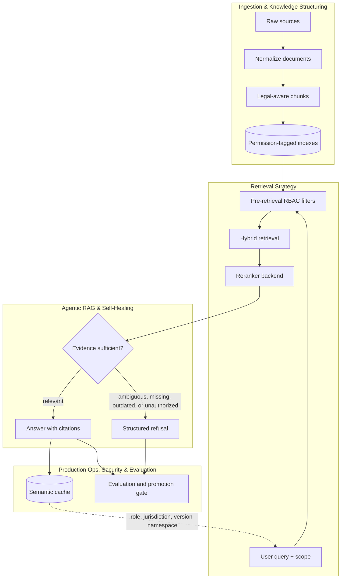

# Architecture Overview

The important control points are:

- legal hierarchy is captured before chunking, not reconstructed in a prompt
- authorization happens before lexical scoring, dense scoring, fusion, reranking, caching, or generation
- exact legal identifiers keep a precise lexical path
- semantic questions use dense retrieval plus RRF and reranking
- the answer layer can only answer from evidence graded as relevant
- cache writes are allowed only for public, relevant, non-exact answers
- promotion gates check citation presence, faithfulness proxy, context precision proxy, exact lookup, semantic lookup, and unauthorized retrieval failures
